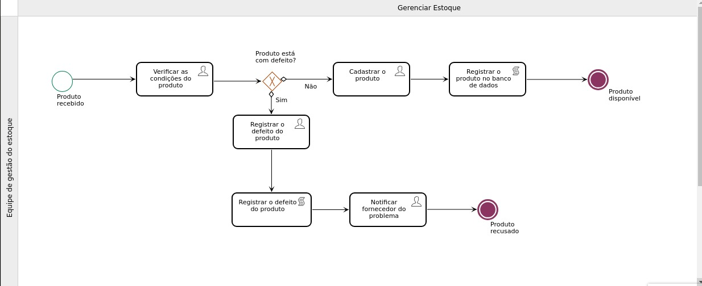
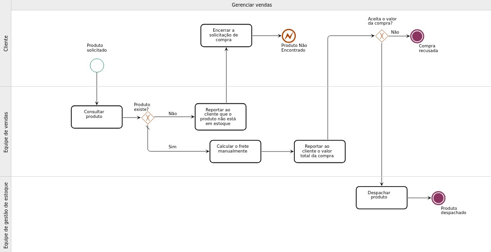
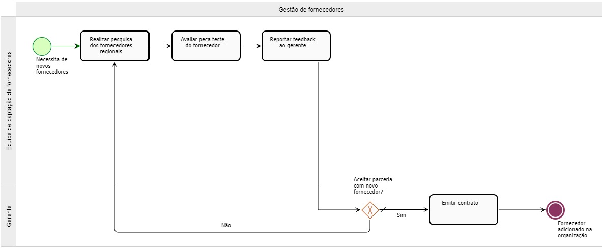

# Processos AS-IS

## Processo 1: Gerenciamento de estoque

O processo de estoque atualmente, em organizações mais simples, é feito pela equipe de gestão do estoque, anotando os produtos de maneira inconsistente e improdutiva. Neste fluxo, os funcionários são encarregados de validar a integridade do produto e reportar aos fornecedores qualquer problema detectado no mesmo ou apenas documentar a existência do item. Tais tarefas, além de não serem tão práticas, estão sujeitas a erros humanos simples, como a documentação errônea dos produtos e riscos de perda dos dados armazenados.
## Processo 2: Processo de Vendas dos produtos

O processo de vendas nas organizações mais simples atualmente é efetuado manualmente pela equipe de vendas, cliente e o time de gestão de estoque, onde o cliente inicia a compra notificando a organização, após isso, os funcionários realizam a consulta do produto e calculam manualmente seu devido frete para realizar o seu despacho, sem se preocupar muito com a documentação da venda. Como consequência, tal processo, torna o rastreio dos produtos menos confiável, gerando muitas vezes, dificuldades na documentação das compras, lentidão no processo devido às altas demandas e o cálculo errado do frete, fugindo do orçamento do cliente. Por conseguinte, isso acaba por gerar frustrações do cliente devido a sua atual condição.
## Processo 3: Processo de Gestao de Fornecedores

O processo de busca dos fornecedores atualmente, em organizações mais básicas, é efetuado de maneira improdutiva pela equipe de captação de fornecedores, onde os mesmos são encarregados de coletar informações sobre os fornecedores manualmente e solicitar a aprovação dos seus gerentes para a inclusão dos mesmos à organização. Como consequência, observa-se uma queda significativa na produtividade dos envolvidos, devido a inúmeros fatores no processo, podendo variar desde a perda ou confusão das informações registradas a gastos de possíveis pesquisas desnecessárias.
